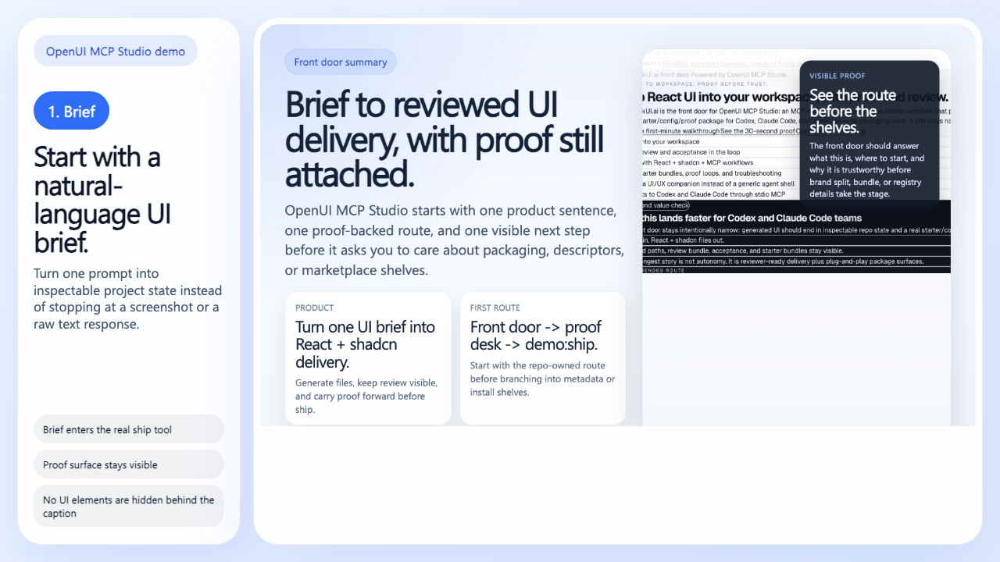
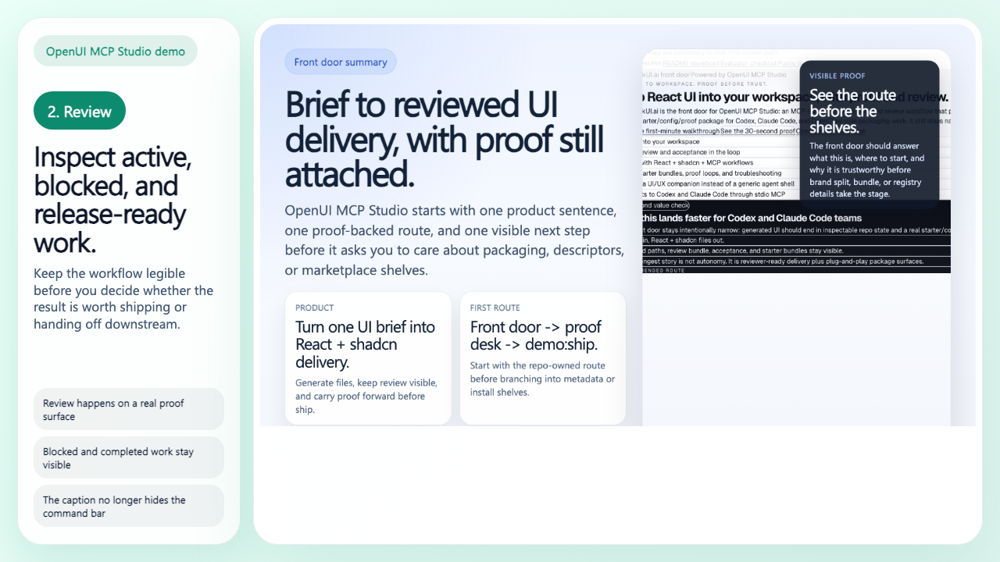
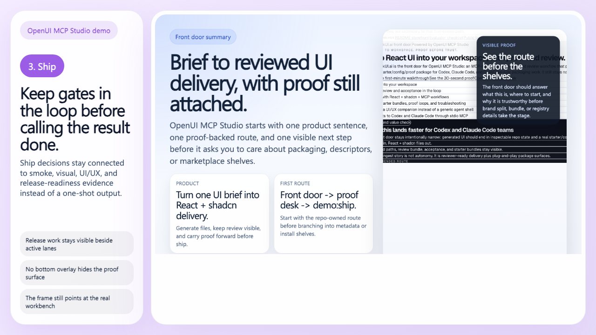
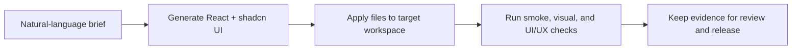

# OpenUI MCP Studio

Turn one UI or UI/UX brief into React + shadcn files, then keep proof, review,
and acceptance visible before you ship them.

OpenUI MCP Studio is the public repo you hand to teams using Codex, Claude
Code, OpenCode, OpenClaw, and other MCP-first clients when they want one
practical `prompt -> files -> proof -> review -> ship` workflow instead of a
generic coding-agent platform.

> Primary runtime:
> local `stdio` MCP through `services/mcp-server/src/main.ts`.
>
> Primary distribution artifact:
> this public GitHub repo, plus repo-owned install bundles and proof surfaces.
>
> Brand split:
> `OneClickUI.ai` is the shorter front-door label.
> `OpenUI MCP Studio` remains the technical product, runtime, and release name.

English is the canonical source of truth for repository governance and
maintenance.

[](https://github.com/xiaojiou176-open/openui-mcp-studio/tags)
[](https://github.com/xiaojiou176-open/openui-mcp-studio/discussions)
[](./LICENSE)
[](./docs/proof-and-faq.md)

[Quick Start](#quick-start) |
[Pages Front Door](https://xiaojiou176-open.github.io/openui-mcp-studio/) |
[Proof Desk](./docs/proof-and-faq.md) |
[Distribution Guide](./DISTRIBUTION.md) |
[Integrations Guide](./INTEGRATIONS.md) |
[Submission Manifest](./manifest.yaml) |
[Distribution Bundle](./examples/public-distribution/README.md) |
[Discovery Guide](./docs/discovery-surfaces.md) |
[Skills Product Line](./examples/skills/README.md) |
[Docs Index](./docs/index.md) |
[Tags](https://github.com/xiaojiou176-open/openui-mcp-studio/tags) |
[Discussions](https://github.com/xiaojiou176-open/openui-mcp-studio/discussions)

<p align="center">
  
</p>

> OpenUI MCP Studio is the public repo for MCP-native UI delivery and review
> across Codex, Claude Code, OpenCode, OpenClaw, and other MCP-first clients.

## Start Fast

Use the shortest path that matches the question in your head:

| If you want to... | Open or run... | What you get |
| --- | --- | --- |
| see one real prompt-to-UI run | `npm run demo:ship` | a genuine brief-to-ship payload from the current repo |
| trust the repo before going deeper | `npm run repo:doctor` | a fast structural check over contracts, runtime, evidence, and release-readiness inputs |
| install or adapt it for another client | [`examples/public-distribution/README.md`](./examples/public-distribution/README.md) | repo-owned configs for Codex, Claude Code, generic MCP hosts, and the current OpenClaw-ready bundle |

## Choose The Right Front Door

Use the shortest route that matches the job in your head:

| If your question is... | Start here |
| --- | --- |
| "What does the repo do in one screen?" | [`README.md`](./README.md) and the [Pages Front Door](https://xiaojiou176-open.github.io/openui-mcp-studio/) |
| "How do I install, submit, or package this truthfully?" | [`DISTRIBUTION.md`](./DISTRIBUTION.md) and [`manifest.yaml`](./manifest.yaml) |
| "Which client or host is this actually ready for?" | [`INTEGRATIONS.md`](./INTEGRATIONS.md) |
| "Where are the repo-owned install bundles and proof loops?" | [`examples/public-distribution/README.md`](./examples/public-distribution/README.md) and [`examples/skills/README.md`](./examples/skills/README.md) |

## What You Get Today

- **Primary runtime:** local `stdio` MCP through `services/mcp-server/src/main.ts`
- **Primary distribution artifact:** this public GitHub repo
- **Install-ready client surfaces:** Codex, Claude Code, and generic MCP hosts
- **Front-row compatible clients:** OpenCode and OpenClaw through the same repo-owned MCP contract and bundle set
- **Official repo-owned skill product line:** `@openui/skills-kit` plus the repo mirror under `examples/skills/`
- **Submission-ready public packaging:** top-level distribution/integration guides, root `manifest.yaml`, and repo-owned Docker/OpenClaw submission packets that still refuse to claim a live listing
- **Supporting lanes:** self-hosted Hosted API and `@openui/sdk`
- **Planned, not current:** live marketplace publication, registry publication, managed hosted deployment, and any claim that a Docker image or catalog listing is already published

## What We Support And What We Do Not Claim

### Current support

- this repo is the main product surface and the main thing you evaluate, star, clone, and hand to another builder
- the canonical builder order stays `local stdio MCP -> compatibility OpenAPI -> repo-local workflow packet`
- local bootstrap remains a construction-only bridge into that workflow, not a competing product front door
- Codex and Claude Code have repo-owned install surfaces today
- OpenCode can reuse the same generic MCP contract, but it is not a dedicated vendor-native install shelf
- OpenClaw is now part of the official repo-owned skill product line, but remains unlisted and not vendor-verified

### Not claimed yet

- an official Codex directory entry
- a listed Claude Code marketplace item
- a live OpenClaw / ClawHub listing
- a managed hosted runtime or SaaS
- a public Docker image or Docker-first install path

## Front Door Map

Read the product surfaces in this order:

1. `README.md` for the storefront
2. `/` for the front door inside `apps/web`
3. `/proof` for the proof desk
4. `/workbench` for the operator desk
5. [`docs/discovery-surfaces.md`](./docs/discovery-surfaces.md) for the route and machine-readable map

## Language Contract

- public docs, metadata, and machine-readable routes stay English-first
- product UI defaults to `en-US` and can switch to `zh-CN` through centralized locale messages
- the front door and key workbench flows reuse that same locale system

## Capability Layers

Read this repository in three layers so the primary product story stays clear.

### 1. Core shipping workflow

This is the mainline capability surface and the shortest honest answer to
"what does OpenUI MCP Studio really do?"

- `openui_detect_shadcn_paths`
- `openui_generate_ui`
- `openui_convert_react_shadcn`
- `openui_make_react_page`
- `openui_apply_files`
- `openui_quality_gate`
- `openui_next_smoke`
- `openui_ship_react_page`

These tools own the default prompt -> generate -> convert -> apply -> verify
workflow. If you only remember one tool, remember
`openui_ship_react_page`.

### 1.5 Delivery intelligence workflow

These tools extend the repository from execution-first shipping into
spec-driven delivery:

- `openui_scan_workspace_profile`
- `openui_plan_change`
- `openui_build_acceptance_pack`
- `openui_build_review_bundle`
- `openui_ship_feature_flow`
- `openui_repo_workflow_summary`

Use them when you need the system to inspect the target workspace first,
produce a structured change plan, attach request-scoped acceptance, or ship a
multi-route feature bundle instead of a single page. Use
`openui_repo_workflow_summary` when you need the repo-local and GitHub-connected
developer-flow picture before a human pushes a branch or updates a PR.

This is where the AI story gets more useful and less fluffy:

- workspace scans act like a repo-aware workflow copilot instead of a generic
  chat box
- change plans explain blast radius and why a path is in scope
- acceptance and review bundles act like risk/approval explainers, not just raw
  logs
- workflow summary and readiness packets act like operator next-step guidance
  for maintainers

These surfaces now lean harder into delivery semantics than before:

- workspace scans return routing/style/pattern evidence plus confidence and
  hotspot hints
- change plans explain why a path is in scope, where the blast radius may widen,
  and why the recommended execution mode is conservative
- acceptance results distinguish automatic checks from manual follow-up instead
  of flattening everything into one pass/fail story
- review bundles now summarize hotspots, auto-checked evidence, and manual
  follow-up in reviewer order
- `openui_ship_feature_flow` now keeps one feature-scoped package plus
  route-scoped artifact directories under the same run, instead of flattening
  everything into one thin top-level shell

### 1.6 Repo workflow bridge

These surfaces connect the local delivery trail to GitHub-facing review
readiness without pretending the repository can mutate remote state by itself:

- `openui_repo_workflow_summary`
- `npm run repo:workflow:ready`

Use them in this order:

- `openui_repo_workflow_summary`
  - raw read-only snapshot of local git state, GitHub checks, open alerts, and
    recent failed runs
- `npm run repo:workflow:ready`
  - maintainer-facing PR/checks-ready packet built on top of the same
    non-mutating truth layers

### 1.7 Builder-facing integration path

If you are evaluating this repo as a builder integration surface, the current
order is:

1. stdio MCP entry for Codex, Claude Code, and other MCP clients
2. compatibility API contract via
   `docs/contracts/openui-mcp.openapi.json`
3. repo-local workflow bridge for read-only readiness packets and maintainer
   handoff
4. repo-local surface guide for zero-context builders:
   `openui-mcp-studio surface-guide`

That is the honest current builder-entry surface. On top of it, the raised-bar
public-distribution program now adds four repo-owned package/distribution lines
without changing the frozen builder order:

- `examples/public-distribution/` bundle for Codex and Claude Code
- `examples/codex/marketplace.sample.json` and `.claude-plugin/marketplace.json`
  for official-surface-compatible distribution packaging
- `examples/public-distribution/openclaw-public-ready.manifest.json`
- `@openui/skills-kit` package surface
- supporting / parked `@openui/sdk` and `openui-mcp-studio hosted ...` lanes

## Current Shared Truth

Round 2 should be read as a shared-truth convergence wave, not as another new
product-expansion push.

The shortest honest read is:

1. repo-local product and audit surfaces are materially thicker in the current
   dirty worktree
2. shared docs are catching up to that live repo-local truth in this wave
3. delivery landed is still a separate Git / PR / remote state question

### UI/UX audit truth

- the repo already had real UI/UX review capability before this convergence wave
- Round 1 / Worker A hardened the shared audit layer with:
  - a reusable style-pack and rubric contract
  - structured `audit` framing in `openui_review_uiux`
  - workspace hotspots, category rollups, and next-step output in
    `tooling/uiux-ai-audit.ts`
- the scoped write-up lives in
  [`docs/architecture/uiux-engine-round1.md`](./docs/architecture/uiux-engine-round1.md)
- shared docs-registry closeout is still a separate governance step; this
  README only states the repo-local surface truth

### Product-surface and bilingual truth

- `apps/web` now carries a real front door plus supporting routes:
  `/`, `/compare`, `/proof`, `/walkthrough`, and `/workbench`
- high-signal bilingual product copy is real in the current dirty slice through
  the centralized message layer and workbench copy sources
- Round 1 / Worker B thickened the product surface without widening into
  marketplace, hosted-builder, or generic-agent claims
- machine-readable mirrors such as `/api/frontdoor`, `/llms.txt`, and the
  manifest remain support truth; they should not be read as proof that every
  shared mirror has already been fully reconciled in this wave

### Builder-surface truth

- local stdio MCP remains the primary builder surface
- the OpenAPI document remains a compatibility and review bridge, not a hosted
  API promise
- the current dirty slice also contains:
  - a root repo-local CLI entrypoint
  - a curated public export layer
  - `repo:workflow:summary` and `repo:workflow:ready`
  - a package-ready public distribution bundle for Codex and Claude Code
  - a public-ready OpenClaw / ClawHub bundle
  - a repo-owned starter-pack package surface via `@openui/skills-kit`
  - supporting / parked SDK and self-hosted Hosted API lanes that stay out of the front-door lead story
- Round 1 / Worker C made those repo-local builder surfaces easier to inspect
  without promoting marketplace listing, managed deployment, or write-capable
  remote MCP lanes into current promises

### Current Repo-Local Vs Delivery-Landed Read

This README describes current repo-local truth.

- `repo-local complete`
  - the dirty slice, shared wording, and verification story agree on the same
    current surface
- `delivery landed`
  - the approved slice has been staged, committed, pushed, and reflected in
    branch or PR state

A repo-local slice can be real without being landed yet. This README does not
claim branch, PR, or remote completion.

For the canonical shared ledger, see
[`docs/strategy/openui-uiux-truth-ledger.md`](./docs/strategy/openui-uiux-truth-ledger.md).

### 2. Supporting review and runtime tools

These tools are real and maintained, but they support the mainline workflow
instead of replacing it.

- `openui_refine_ui`
- `openui_review_uiux`
- `openui_list_models`
- `openui_embed_content`

Use them when you need iteration, review, or provider/runtime inspection around
the core shipping path.

### 3. Advanced or non-primary surfaces

These tools exist in the live MCP server, but they are not the first thing this
repository should be judged by.

- `openui_rag_upsert`
- `openui_rag_search`
- `openui_observe_screen`
- `openui_execute_ui_action`
- `openui_computer_use_loop`

Treat them as advanced or exploratory surfaces. The public product story of
this repository still centers on governed UI shipping, not on generic RAG or
computer-use orchestration.

Feature-flow honesty boundary:

- feature-level delivery is now more than "run page ship twice"
- route-level artifacts are retained under feature-scoped route directories
- feature-level quality, acceptance, and review rollups now exist
- this still does **not** mean every multi-route flow is production-ready
  without reviewer judgment

Important boundary notes:

- The RAG tools use a local in-memory index for the current server process.
  They help with session-scoped retrieval experiments; they are not the
  repository's durable knowledge-storage story.
- The computer-use tools currently provide Gemini observation plus guarded
  action and loop semantics with safety confirmation. They should not be read
  as a full browser-driving runtime by themselves.

## Proof Ladder

Use the lightest path that answers your real question.

| Path | Use it when | What it proves | What it does not prove |
| --- | --- | --- | --- |
| `npm run demo:ship` | your machine is already ready and you want one fast proof | one real ship-tool payload from the current repo | not a cold-start setup, not `repo:verify:full`, not a public-safe verdict |
| `npm run repo:doctor` | you want a fast structural trust check | the repo-side contracts, runtime, evidence, upstream policy, and release-readiness inputs are healthy | not full local parity and not remote platform closure by itself |
| `npm run repo:verify:fast` | you want a stronger deterministic local check without replaying the full CI container lane | the local structural governance path still holds | not container parity and not remote GitHub governance truth by itself |
| `npm run repo:verify:full` | you intentionally want the manual heavy local parity lane | the local container-parity verification path still holds | not remote GitHub governance truth by itself and not a routine everyday command |
| `npm run release:public-safe:check` | you want the strict repo-side public-safe verdict | docs, remote evidence, canonical history hygiene, local heads/tags sensitive-surface history, and GitHub public-surface review agree on a strict repo-side verdict | not legal sign-off, product judgment, or rollout approval |
| `npm run pages:build` | you want the GitHub Pages-ready static export of the current front door | `apps/web` can be exported as a project-pages artifact for `xiaojiou176-open/openui-mcp-studio` | not proof that GitHub Pages is already enabled or deployed by itself |

The live Gemini lane stays outside the default PR hot path:

- manual `workflow_dispatch` only
- explicit `run_live_gemini=true` opt-in
- protected GitHub environment review before the live job starts

## Fastest Visible Proof

Use this path only when your local environment is already ready.
This is the **warm-start** proof lane, not the clean-machine setup path.

```bash
npm run demo:ship
```

This path assumes:

- Node `22.22.0` is already available
- repo dependencies are already installed (you have already run `npm install` in this checkout)
- `GEMINI_API_KEY` is already set in `.env` or your shell
- you only need one rerunnable proof, not a full clean-room setup

What this gives you right away:

- a real run of `openui_ship_react_page`, not a fake placeholder command
- generated React and shadcn file output printed as JSON
- a safe default preview path because the demo stays in `dryRun` mode unless you
  opt into `--apply`
- one rerunnable proof that the ship tool is live, **not** a replacement for
  `repo:verify:full` or `release:public-safe:check`

The built-in sample prompt asks for a polished pricing-page hero. If you want to
swap in your own brief:

```bash
npm run demo:ship -- --prompt "Create a launch-ready landing hero with a headline, CTA row, feature grid, and testimonial strip."
```

If you want the demo to actually write into the default proof target:

```bash
npm run demo:ship -- --apply
```

If your Gemini route is slow and you want a more forgiving first run:

```bash
npm run demo:ship -- --timeout-ms 120000
```

If you are starting from a completely cold machine, use
[Cold Start Quick Start](#cold-start-quick-start) instead. That path installs
Playwright, builds the repository, and proves the default proof target end to
end.

## Use Cases

<p align="center">
  
</p>

- Evaluate whether natural-language UI briefs can turn into a reviewable React
  and shadcn workflow.
- Compare trust, not only output, by keeping apply, smoke, visual review, and
  release readiness visible.
- Show the workflow to other people with reusable proof assets, release assets,
  and public discussions.

### Built For

- teams evaluating AI-assisted frontend delivery without giving up review gates
- developers who want generated UI to land as React, Tailwind, and shadcn files
- people who need a repeatable workflow they can revisit, demo, and audit later

<table>
  <tr>
    <td width="50%">
      <strong>Good fit</strong><br />
      Natural-language UI generation with a reviewable delivery path, real proof
      surface, and repeatable validation.
    </td>
    <td width="50%">
      <strong>Not the right fit</strong><br />
      Hosted zero-setup SaaS expectations, static screenshot generation, or a
      generic frontend starter with no MCP workflow.
    </td>
  </tr>
</table>

### Not Just Another Generator

This repository is closer to a shipping studio than a prompt toy.

- It can generate UI from a brief.
- It can apply files into the target workspace.
- It can run quality gates before you treat the result as done.
- It keeps runtime evidence so the result is inspectable, not magical.

<p align="center">
  
</p>

## Visual Tour

These frames are meant to be read as evidence, not as decorative thumbnails.

**1. Brief**
Start from a natural-language UI request.



**2. Review**
Inspect the workbench before trusting the output.



**3. Ship**
Keep gates in the loop before calling it done.



## Quick Start

### Prerequisites

- Node `22.22.0`
- A valid `GEMINI_API_KEY`
- Playwright browsers installed once for the local proof surface

### Cold Start Quick Start

Use this path when you are starting from a clean or mostly clean machine and
want the repository front door to prove it is alive.

```bash
npm install
cp .env.example .env
npx playwright install chromium
npm run build
npm run demo:ship
npm start
```

### What You Should See

After the fastest path:

- `npm run demo:ship` returns generated file payloads from the real ship tool
- the MCP server starts from
  `.runtime-cache/build/mcp-server/services/mcp-server/src/main.js`
- the default proof target remains `apps/web`
- the front door lives at `/`, `/proof` stays the proof desk, and `/workbench` stays the interactive operator desk
- you can inspect the repository's product-facing surface before diving into
  deeper governance paths

The demo command prefers `GEMINI_MODEL_FAST` when that env var is available and
lets you raise the request window with `--timeout-ms` for slower live provider
runs.

### Warm Start Quick Proof

If your machine already has Node, dependencies, and `GEMINI_API_KEY` in place,
use [`docs/first-minute-walkthrough.md`](./docs/first-minute-walkthrough.md)
for the faster warm-start route.

### Stricter Repo-Side Verification

If you want the stricter path that proves the repository is not a one-shot demo,
run the repo-side verification lane:

```bash
npm run repo:doctor
npm run repo:verify:fast
npm run repo:space:report
npm run repo:space:check
npm run repo:space:verify
npm run repo:space:maintain:dry-run
npm run smoke:e2e
```

If you intentionally want the manual heavy local parity path rather than the
lighter front-door checks, run:

```bash
npm run repo:verify:full
```

If the locked CI image is unavailable and you explicitly want this machine to
bootstrap it locally first, use:

```bash
npm run ci:local:container:bootstrap
```

### Full Governed Path

Use this path when you are evaluating public-safe trust, not just startup.

```bash
npm run lint
npm run typecheck
npm run test
npm run test:e2e
npm run smoke:e2e
npm run release:public-safe:check
```

## Demo Proof

The public proof surface comes from the real workbench and front-door proof
narrative rather than synthetic marketing art.

<p align="center">
  
</p>

### The Core Flow In One View



For a deeper walkthrough, see [Demo Proof and FAQ](./docs/proof-and-faq.md).

## How It Works

You can think of the system like a product studio with two visible desks. The
proof desk explains what evidence exists and what it means. The operator desk
shows which lane is active, which work item needs attention, and what the next
sensible action is. The model drafts the work, the repository applies it
safely, and the quality gates decide whether the output is good enough to keep
moving.

1. The MCP server receives a UI brief.
2. The ship pipeline generates HTML and converts it into React and shadcn files.
3. Files are applied under repository path rules.
4. Quality gates check the result before you treat it as a trustworthy output.
5. Runtime evidence is stored under `.runtime-cache/runs/<run_id>/...` so the
   workflow is inspectable.

The implementation entrypoint stays at
`services/mcp-server/src/main.ts`, while `apps/web` is the default proof target
for smoke, E2E, visual, and UI/UX checks.

The broader repository identity still matters:

- `services/mcp-server` is the runtime and orchestration center.
- `contracts/*` and `tooling/*` stay in the public story because they define how
  the governed delivery path stays trustworthy.
- This repository is a long-lived productized fork and uses selective port
  maintenance instead of whole-repo upstream merge as the default route.

## What Makes It Different

| Tool style               | What you get                                                             | What is missing                                     |
| ------------------------ | ------------------------------------------------------------------------ | --------------------------------------------------- |
| Pure code generator      | Fast output                                                              | Usually stops before apply, proof, or quality gates |
| Generic UI demo repo     | Nice screenshots                                                         | Weak evidence that the workflow can ship real files |
| Agent flow without gates | Flexible automation                                                      | Harder to trust the result under repeatable checks  |
| **OpenUI MCP Studio**    | Generation, application, proof, and operator guidance in one path        | Still needs your product judgment for what to ship  |

### Why It Wins For Evaluation

- **More than "looks good"**: the result can be smoke-tested and reviewed.
- **More than "the model said so"**: runtime evidence is kept for follow-up.
- **More than a fixture**: `apps/web` is treated as the default proof surface,
  not a disposable demo page.

## Hard Evidence You Can Re-Run

These are not marketing bullets. They are front-door checks you can rerun on
your own machine.

| What you want to verify | Command | What you should get back |
| --- | --- | --- |
| Can it produce one real UI result fast? | `npm run demo:ship` | generated file payload for a sample brief |
| Is the repo structurally healthy? | `npm run repo:doctor` | repository-side readiness verdict |
| What is taking repo-local space right now? | `npm run repo:space:report` | repo-local managed surfaces, repo-specific external cache roots, machine-wide shared-layer defer map, and reclaimable bytes by cleanup class |
| Is repo-local space governance drifting? | `npm run repo:space:check` | front-door repo-local gate verdict: no hard-fail pollution and no unknown heavy non-canonical runtime subtree |
| Which candidates are currently eligible for controlled repo-local maintenance? | `npm run repo:space:verify` | repo-local maintenance candidates plus a separate report-only block for repo-specific external cache targets |
| What would the current repo-local maintenance wave reclaim without deleting anything? | `npm run repo:space:maintain:dry-run` | projected repo-local reclaim plan, skip reasons, and excluded repo-specific external targets |
| Apply the explicit repo-local maintenance wave | `npm run repo:space:maintain` | controlled repo-local cleanup summary under `.runtime-cache/reports/space-governance/maintenance-latest.*` |
| What is the current repo-side security evidence bundle? | `npm run security:evidence:final` | PII + sensitive-surface + local history-sensitive + ScanCode final evidence pack under `.runtime-cache/reports/security/` |
| What is the current remote canonical review verdict? | `npm run governance:remote:review` | remote/platform review plus mirror audit summary |
| What is the raw GitHub/workflow snapshot right now? | `npm run repo:workflow:summary` | read-only repo-local + GitHub-connected snapshot with required checks, alert counts, and recent failed runs |
| What is the current PR/checks-ready packet? | `npm run repo:workflow:ready` | repo-local vs GitHub-connected vs remote-mutation vs external-blocker split for the next developer-flow move |
| Does the default proof target boot like a real app? | `npm run smoke:e2e` | smoke verdict against `apps/web` |
| Do the public assets and GitHub surface stay aligned? | `npm run public:surface:check` | local asset freshness plus live public-surface contract |

For MCP consumers, the raw read-only GitHub workflow surface is
`openui_repo_workflow_summary`.
For maintainers, `npm run repo:workflow:ready` is the higher-level packet that
writes release-readiness artifacts without pushing a branch or mutating GitHub.
If you want the current ecosystem packaging truth, run
`node tooling/cli/openui.mjs ecosystem-guide --json`.

## Why Keep It On Your Radar

This repository is worth starring when you want a reference that is both useful
today and easy to revisit later.

| Reason to bookmark it | Plain generator repo                        | OpenUI MCP Studio                                                                   |
| --------------------- | ------------------------------------------- | ----------------------------------------------------------------------------------- |
| First visible result  | often starts with a screenshot or a promise | `npm run demo:ship` gives you a real ship payload                                   |
| Trust story           | you wire your own checks                    | proof target, smoke, visual, UI/UX, and release checks are already part of the repo |
| Reuse value           | one-off prompt experiments                  | repeatable workflow you can demo, compare, and share                                |
| Public proof          | scattered or missing                        | release assets, Discussions, docs router, and proof pages already lined up          |

If you want the canonical explanation of what those proof commands do and do
**not** prove, use [Demo Proof and FAQ](./docs/proof-and-faq.md).

## When This Is A Good Fit

- You want natural-language UI generation with a reviewable delivery path.
- You care about applying files and validating them, not only seeing model
  output.
- You want a local MCP-first workflow that can plug into tools like Claude Code
  and Codex.

## When This Is Not A Good Fit

- You only want a static screenshot generator.
- You need a hosted SaaS with zero local setup.
- You want a generic frontend starter without MCP, runtime evidence, or quality
  gate discipline.

## Proof And Trust

This repository is not asking you to trust a beautiful screenshot. It keeps a
real engineering trail.

<p align="center">
  
</p>

- `npm run repo:doctor`
  - quick repository health check across governance, runtime, and readiness
- `npm run repo:space:report`
  - shows repo-local managed surfaces, repo-specific external cache roots, repo-owned persistent browser assets, and machine-wide shared layers as separate layers
  - includes the configured `~/.cache/openui-mcp-studio/tooling` base root, workspace token, janitor TTL/cap policy, repo browser lane readout (`Profile 1` / `9343` / instance state / janitor exclusion), and repo-owned Docker residue readout
- `npm run repo:space:check`
  - front-door repo-local space-governance gate; fails on hard-fail pollution and unknown heavy non-canonical runtime subtrees
- `npm run repo:space:verify`
  - reports contract verification candidates plus repo-local maintenance eligibility, active-ref state, age, and skip reasons
  - keeps repo-specific external cache targets in a separate repo-specific block with janitor policy readback
  - keeps the repo browser lane in a separate persistent-asset block so maintenance commands never treat it as TTL/cap cache
- `npm run repo:space:maintain:dry-run`
  - generates the explicit no-delete maintenance plan for repo-local cleanup
  - includes the projected repo-specific external cache janitor reclaim plan
- `npm run repo:space:maintain`
  - applies the explicit repo-local maintenance wave and writes `maintenance-latest.*` under `.runtime-cache/reports/space-governance/`
  - also writes the latest external tool-cache janitor receipt under `.runtime-cache/reports/space-governance/`
- `.runtime-cache/ci-local-host/`
  - is part of the maintenance contract, not just the reporting layer
  - keeps `ms-playwright`, `node_modules`, and `openui-home` in the disposable-generated bucket
  - keeps `tmp/` in the scratch bucket
  - ages out on the 3-day TTL / 72-hour maintenance window recorded in the path registry
- `.runtime-cache/locks/`
  - is governed repo-local temporary coordination state, not a stray top-level cache
  - exists so repo-owned gates can coordinate short-lived lock files without escaping `.runtime-cache/*`
  - is purged by the registered runtime cleanup lane instead of failing runtime-governance as an unknown subtree
- `npm run smoke:e2e`
  - confirms the default proof surface boots and behaves like a real app
- `npm run pages:build`
  - exports the current front door into `apps/web/out` for GitHub Pages deployment
- `npm run release:public-safe:check`
  - confirms public-release discipline rather than "it worked on my machine"
  - runs the strict docs lane in addition to release-readiness and remote/history checks
- `npm run security:oss:audit`
  - confirms the repo-local OSS security bundle across history, trufflehog, dependency review preflight, and supplemental scanners
- `npm run governance:history-hygiene:check`
  - makes sure release confidence is not based on current-tree scans alone

Machine-level shared layers remain outside the default repo-local maintenance lane:

- Docker.raw
- `~/.npm`
- `~/.cache/pre-commit`
- `~/Library/Caches/ms-playwright`
- Cursor `workspaceStorage` / `globalStorage`

Treat those as operator-maintained machine surfaces rather than `repo:space:maintain` targets.

Repo-specific external cache roots are a separate middle layer:

- they are repo-attributable because the path includes the workspace token
- they now live under `~/.cache/openui-mcp-studio/tooling/<workspaceToken>/...`
- they use default janitor policy of `3 days / 5 GiB / 60 minutes`
- `repo:space:report`, `repo:space:verify`, and `repo:space:maintain:*` surface the current janitor state and latest cleanup receipt

Real Chrome profile policy is separate from cache policy:

- local-only real Chrome flows read `OPENUI_CHROME_USER_DATA_DIR` + `OPENUI_CHROME_PROFILE_DIRECTORY` + `OPENUI_CHROME_CDP_PORT`
- missing env is a hard configuration blocker for real-profile flows
- the canonical isolated root is `~/.cache/openui-mcp-studio/browser/chrome-user-data` and the canonical profile directory is `Profile 1`
- the lane is single-instance by policy and uses CDP attach on port `9343` instead of second-launching the same root
- real Chrome profile data is an identity/session asset, not a cache, so it is never auto-cleaned by repo janitors
- cloud CI keeps login-dependent browser tests disabled by default

In plain language:

- this is **not** just a demo screenshot repo
- generated UI is **not** treated as automatically good enough
- public-facing trust is backed by explicit checks instead of hand-waving

## Community And Release Surface

### Quick Links

- [Docs Index](./docs/index.md)
- [Architecture](./docs/architecture.md)
- [Testing Guide](./docs/testing.md)
- [Proof and FAQ](./docs/proof-and-faq.md)
- [Evaluator Checklist](./docs/evaluator-checklist.md)
- [Public Surface Guide](./docs/public-surface-guide.md)
- [Release Notes Template](./docs/release-template.md)

### Participate

- [License](./LICENSE)
- [Contributing Guide](./CONTRIBUTING.md)
- [Support Guide](./SUPPORT.md)
- [Security Policy](./SECURITY.md)
- [Codeowners](./CODEOWNERS)
- [Code of Conduct](./CODE_OF_CONDUCT.md)

### GitHub Surface

- Discussions are the home for questions, ideas, and show-and-tell threads.
- Issues stay focused on reproducible bugs and workflow failures.
- The latest published GitHub release is `v0.3.0`, and it already carries the
  current public asset bundle used across the proof and storefront surfaces.
- Release notes, future release-asset refreshes, and future Discussions curation
  still need operator follow-through when the public story changes again.
- The GitHub Homepage field now points at the live GitHub Pages front door:
  `https://xiaojiou176-open.github.io/openui-mcp-studio/`.
  Social Preview still remains a settings-managed surface that needs explicit
  operator verification whenever it changes.
- `npm run repo:workflow:ready` is the maintainer-facing PR/checks-ready packet.
  It stays read-only on purpose: repo-local state + live GitHub truth in one
  packet, but no push, PR mutation, or settings changes.

## Connect It To Your MCP Client

### Claude Code

```bash
claude mcp add --transport stdio --env GEMINI_API_KEY=your_key openui -- \
  node /ABS/PATH/openui-mcp-studio/.runtime-cache/build/mcp-server/services/mcp-server/src/main.js
```

### Codex CLI

```bash
codex mcp add openui --env GEMINI_API_KEY=your_key -- \
  node /ABS/PATH/openui-mcp-studio/.runtime-cache/build/mcp-server/services/mcp-server/src/main.js
```

These are the repo-owned starter install snippets for the current plugin-grade
public distribution package.
They do **not** imply a Codex plugin marketplace item, a Claude Code plugin
listing, or a hosted API surface.

### Other stdio MCP hosts

If another host can spawn a local stdio MCP process, adapt the same repo-owned
launch contract:

```json
{
  "command": "node",
  "args": [
    "/ABS/PATH/openui-mcp-studio/.runtime-cache/build/mcp-server/services/mcp-server/src/main.js"
  ],
  "env": {
    "GEMINI_API_KEY": "your_key"
  }
}
```

That template is the strongest honest starting point for other MCP-capable
hosts. It is still **not** proof of a vendor-native listing, a verified host
integration, or a hosted runtime.

If you want the quickest repo-owned builder orientation after install, use:

```bash
openui-mcp-studio surface-guide
openui-mcp-studio ecosystem-guide --json
openui-mcp-studio skills starter --json
node tooling/public-distribution-proof.mjs
```

The skills starter command now returns the package root, repo mirror, install
path, use path, and verification path for `@openui/skills-kit` so a zero-context
builder does not have to spelunk through repo internals first.

If you want the ready-made bundle files instead of copying from prose, use:

- `examples/public-distribution/codex.mcp.json`
- `examples/public-distribution/claude-code.mcp.json`
- `examples/public-distribution/generic-mcp.json`
- `examples/public-distribution/openclaw-public-ready.manifest.json`
- `examples/public-distribution/troubleshooting.md`
- `examples/codex/marketplace.sample.json`
- `.claude-plugin/marketplace.json`

### What About OpenHands, OpenCode, And OpenClaw?

Current support truth is deliberately split:

- `Codex` and `Claude Code` have the strongest repo-owned install surfaces today through local stdio configs, starter bundles, proof loops, and troubleshooting
- `OpenCode` is a front-row compatibility target that should reuse the same repo-owned generic MCP contract; this repo does **not** claim a dedicated OpenCode install shelf or official integration
- `OpenClaw` is now part of the official repo-owned skill product line through starter bundles, proof loops, and public-ready manifests, but it is still **not** claimed as listed, published, or vendor-approved
- `OpenHands` remains comparison / positioning context, not a current install surface

That means this repo can honestly help people evaluate category fit across
those names, install the current repo into Codex and Claude Code, adapt the
same MCP contract for OpenCode-style hosts, and inspect the official repo-owned
skill product line for OpenClaw-side work.

### Sample Prompt To Paste

Use this exact brief if you want the same quick demo that powers `npm run demo:ship`:

```text
Create a polished pricing page hero for OpenUI MCP Studio. Include a short headline, a one-line value proposition, three pricing tiers, one highlighted recommended plan, and a compact trust row for smoke, visual, and release checks.
```

## FAQ

### Is this the same thing as upstream OpenUI?

No. This repository is a long-lived productized fork that keeps upstream
visible for selective adoption while focusing on a governed MCP-based UI
shipping workflow.

### Why call it a studio?

Because the repository is designed around the whole path from brief to reviewed
output. It is not only a code emitter and it is not only a frontend sample.

### Is this already a plugin, SDK, or hosted API product?

The repo already ships real supporting product lines, but they are not equal.

Current truth is:

- **main product and main distribution artifact:** this public GitHub repo
- **primary runtime:** local stdio MCP
- **supporting install surfaces:** Codex and Claude Code plugin-grade bundles
- **official repo-owned skill product line:** `@openui/skills-kit` plus repo-owned skill/bundle mirrors, including the OpenClaw-facing line
- **supporting / parked lanes:** `@openui/sdk` and the self-hosted Hosted API

What still does **not** exist as current truth:

- a live listed marketplace / plugin / ClawHub entry
- live registry publication for the root repo artifact
- a public Docker runtime distribution
- managed hosted SaaS deployment

### Does it change runtime contracts?

No. This README changes the public presentation layer. It does not change MCP
tool contracts, env contracts, or the ship pipeline behavior.
