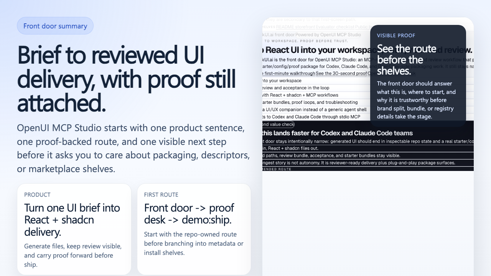
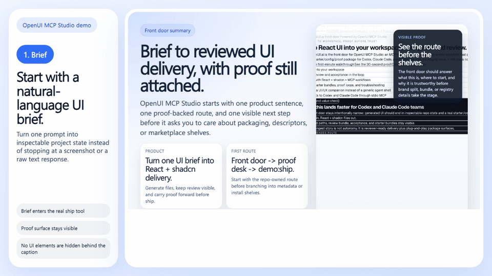

# Demo Proof And FAQ

This page gives the shortest public answer to a practical question:

> Does OpenUI MCP Studio actually do more than produce a pretty screenshot?

The short answer is yes. The repository is built around a workflow that can
generate UI, apply files, and validate the result through repository-owned
checks. Just as importantly, it gives reviewers and operators a clearer place
to ask "what proof do we have?" before they ask "should we trust this yet?"

This proof story should now be read through a narrower product lens:

- UI/UX vertical companion
- execution and review first
- repo first, MCP-native distribution artifact
- Codex / Claude Code / OpenCode / OpenClaw friendly through MCP
- repo-owned supporting install bundles and an official skill product line are current
- not a generic autonomous coding-agent promise

Think of this page as the repository's proof desk:

- `README.md` is the storefront
- this page is the canonical proof explanation
- `/proof` is the public proof route for the same story inside `apps/web`
- `/workbench` is the operator desk for pipeline, review, release, and next-step actions
- `docs/evaluator-checklist.md` is the scorecard you can skim quickly

Current wave note:

- the proof route now reads more explicitly as a proof contract
- the page separates packet anatomy from routing more clearly
- a visible “not proved here” strip now makes overclaim boundaries easier to spot

## Proof Desk Map

Use the repository surfaces like a set of counters in the same room:

| Surface | Best question to bring there | Why it exists |
| --- | --- | --- |
| `README.md` | "What is this repo trying to do?" | storefront and product positioning |
| `docs/discovery-surfaces.md` | "How do the front door, machine-readable routes, and builder entry order fit together?" | discovery map and builder-entry explanation |
| this page / `/proof` | "What evidence exists, and what does each proof lane really prove?" | proof desk and reviewer-facing explanation |
| `/workbench` | "What should the operator or reviewer look at next?" | repo-local operator desk for pipeline, review, and release lanes |
| `docs/evaluator-checklist.md` | "Can I score this quickly?" | compressed acceptance scorecard |

## Warm-Start Proof

If you want one command that proves the repository can do more than show
screenshots, run:

```bash
npm run demo:ship
```

That command executes the real `openui_ship_react_page` tool with a built-in
pricing-page prompt and prints the generated file payload as JSON. It stays in
`dryRun` mode by default so you can inspect the result before writing files.
It also prefers `GEMINI_MODEL_FAST` when available and supports
`--timeout-ms 120000` if your live Gemini route needs a wider request window.

If your machine is not ready yet, go back to the [README Quick Start](../README.md#quick-start)
first. This page explains proof semantics; it does not replace first-time setup.

## What Each Proof Command Proves

| Command | What it proves | What it does not prove |
| --- | --- | --- |
| `npm run demo:ship` | one rerunnable ship-tool payload from the current repo | not a replacement for smoke, UI/UX, or release checks |
| `npm run repo:doctor` | front-door repository health across governance, runtime, evidence, upstream, and release-readiness inputs | not a full CI substitute and not a hosted-platform uptime guarantee |
| `openui-mcp-studio skills starter --json` | machine-readable view of the repo-owned skill product line and its bundle truth | not proof of an official marketplace or catalog listing |
| `openui-mcp-studio ecosystem-guide --json` | current repo distribution story, supporting install bundles, skill product line, and parked lanes in one CLI packet | not proof of vendor approval or registry publication |
| `npm run smoke:e2e` | the default proof target still boots and behaves like a real app | not proof that every generated UI is production-ready |
| `npm run release:public-safe:check` | the strict repo-side public-safe verdict across docs, release-readiness, remote evidence, and history hygiene | not legal sign-off, product judgment, or rollout approval |

## Proof Tiers

Use this table when you want the shortest honest answer to "which proof lane am I
looking at?"

| Lane | Primary command | Best for | What it proves | What it still does not prove |
| --- | --- | --- | --- | --- |
| Warm-start visible proof | `npm run demo:ship` | already-configured local evaluation | the real ship tool can return one rerunnable payload quickly | not a full gate, not a public-safe verdict |
| Front-door repo health | `npm run repo:doctor` | quick structural trust check | repo-side contracts, runtime, evidence, upstream policy, and release-readiness inputs are in a healthy shape | not full local parity and not remote platform closure by itself |
| Fast local structural verify | `npm run repo:verify:fast` | stronger deterministic local verification without replaying the full CI container lane | the local structural governance path still holds | not local container parity and not remote GitHub governance truth |
| Default proof target runtime proof | `npm run smoke:e2e` | proving the sample surface is alive | `apps/web` still boots and answers like a real app | not proof that every generated UI should ship |
| Manual local parity | `npm run repo:verify:full` | deeper repo-side confidence when you intentionally want the heavy local parity lane | the local container-parity verification path still holds | not remote GitHub governance truth by itself and not the default front-door path |
| Public-safe release verdict | `npm run release:public-safe:check` | deciding whether repo-side public claims are safe | docs, release-readiness, remote evidence, and history hygiene agree on a strict repo-side verdict | not legal sign-off, product judgment, or rollout approval |

## Demo Proof






## Generated, Applied, And Verified

Use this repository when you want one path that covers all three layers:

1. **Generated**
   A natural-language brief is converted into React and shadcn-oriented output.
2. **Applied**
   The repository applies files into the target workspace instead of stopping at
   a raw text response.
3. **Verified**
   Smoke, visual, UI/UX, and release-readiness checks give you evidence that the
   result is worth reviewing.

The delivery plane now also has explicit preflight surfaces:

- workspace profile scanning
- change planning
- request-scoped acceptance packs
- unified review bundles
- feature-flow shipping

Those surfaces should now be read with a more explicit trust boundary:

- workspace profiles expose confidence, evidence anchors, and hotspots instead
  of pretending the scan fully understands the target repo
- change plans explain why a path is in scope and why the current execution mode
  is cautious
- acceptance distinguishes automatic checks from manual follow-up
- review bundles prioritize reviewer summaries over raw payload sprawl
- feature-flow now keeps route-level artifact directories plus a feature-level
  package under one run-scoped artifact tree, so reviewers can inspect both the
  overall story and each route's local evidence without losing the shared
  feature summary

## Proof Desk Vs Operator Desk

These two surfaces are related, but they are not the same job:

| Surface | Main audience | Main question | What you should expect |
| --- | --- | --- | --- |
| `/proof` and this FAQ | evaluator, reviewer, curious maintainer | "What evidence exists and how strong is it?" | proof tiers, command meanings, honest boundaries |
| `/workbench` | operator, maintainer, active reviewer | "What lane needs attention and what is the next move?" | pipeline tabs, review/release work items, quality signals, promotion actions |

In plain language: the proof desk explains the receipt, while the operator desk
is the counter where someone decides what to do with that receipt.

## Current Prompt 4 Reading

If you want the shortest honest Prompt 4 interpretation, read the surfaces like
this:

- `/proof`
  - what the repo already proves
  - what still needs a human judgment call
  - which next route makes sense when the evidence agrees
- `/workbench`
  - which packet is live right now
  - what the next operator move is
  - which stop-sign means "pause instead of promote"

That is deliberately narrower than a generic AI dashboard. The value here is
not "lots of cards." The value is clearer proof and clearer next-step guidance.

## What The Proof Desk Separates Now

If you want the Prompt 4 version in one glance, `/proof` now keeps three
questions apart on purpose:

1. what the repo has already proved
2. what still needs human judgment
3. what the operator should do next

That separation matters because a green-looking packet can still need a human
release call. The proof desk keeps that boundary visible instead of flattening
everything into one optimistic summary.

The workbench then picks up from there:

- current focus stays visible
- next-step guidance stays visible
- pause conditions stay visible
- a direct route back to `/proof` stays visible when the operator needs proof
  meaning before action

## Current Proof Split

When this repository is behaving honestly, the proof desk should separate three
questions instead of mixing them together:

| Layer | Main question | Current surface |
| --- | --- | --- |
| Repo-proved now | "What evidence is already on repo-owned surfaces?" | prompt, changed files, review bundle, acceptance result, proof target |
| Human judgement still required | "What still needs a reviewer instead of a green packet?" | shared-surface polish, final design confidence, release judgment |
| Operator next step | "What should happen now?" | continue in `/workbench`, return to proof docs, or stop for manual review |

That split is the point of Prompt 4 surface polish. The goal is not to invent
new capabilities, but to make the existing proof story easier to sort at a
glance.

## Prompt 4 Proof Split

Read the current proof desk in three quick buckets before you keep scrolling:

1. what the repository already proves on its own
2. what still needs a reviewer or operator to decide
3. what the next sensible move is if those two buckets agree

That split is deliberate. It keeps `/proof` from collapsing back into a long
marketing narrative and keeps `/workbench` from acting like a generic dashboard.

## Repo-Local Complete Vs Delivery Landed

Prompt 5 adds one more line that evaluators should keep visible:

| State | What it means | What it still does not mean |
| --- | --- | --- |
| `repo-local complete` | the current worktree, proof packet, docs, and local verification agree on the same slice of truth | not yet a commit, push, PR update, or remote merge |
| `delivery landed` | the approved slice has actually moved into Git history or PR state | not proof that every later lane has been evaluated |

In plain language: the proof desk explains whether the current local packet is
coherent. The operator desk then decides whether the next move is “review it,”
“stop it,” or “land it through Git.”

## Why `apps/web` Matters

`apps/web` is the default proof target. That means the repository keeps a real
page surface ready for smoke, E2E, visual, and UI/UX checks instead of asking
you to imagine the workflow in the abstract.

Inside that app, the routes now split their jobs:

- `/` is the product front door
- `/proof` is the proof desk and shortest evidence narrative
- `/workbench` is the operator desk for pipeline, review, release, and
  next-step guidance
- `/compare` and `/walkthrough` are supporting evaluation and positioning
  routes

It does **not** mean `apps/web` is a second marketing site. The README and docs
router remain the public story. `apps/web` exists to prove the workflow on a
real surface.

## Language Boundary

The proof surface now follows a minimal real i18n contract:

- public pages stay English-first
- default locale is `en-US`
- product UI can switch to `zh-CN`
- new bilingual UI copy must come from centralized message sources, not
  scattered mixed-language literals
- Prompt 2 expanded that from shell-level switching into visible frontdoor and
  workbench flows
- Prompt 4 continues that by tightening proof-desk and operator-desk copy on
  the highest-signal paths before widening into long-tail parity

## Trust Stack

If you want the short version of why this repository feels more trustworthy
than a plain generator, it comes down to four visible layers:

1. a real proof surface
2. quality gates that stay in the loop
3. public routing that helps evaluators start in the right place
4. governance that shows up as evidence instead of marketing fog

That is the short version of the product claim:

> OpenUI MCP Studio is for teams who want UI generation to end in inspectable
> project state, not just model output.

## FAQ

### What is the relationship to OpenUI?

This repository is a long-lived productized fork. It keeps upstream OpenUI
visible for selective adoption, but its day-to-day identity is a governed MCP
studio for UI shipping.

### Why is it called a studio instead of a generator?

Because the repository owns more of the journey. It starts from a brief, but it
also owns file application, proof surfaces, and quality gates.

### When should I open `/proof` instead of `/workbench`?

Open `/proof` when you need the honest explanation of the evidence: what each
command proves, how strong that proof is, and where the boundary still is.
Open `/workbench` when you are already operating the flow and need review,
release, or next-step guidance across live lanes.

If you still cannot answer "what is already proved, what still needs a human,
and what should I do next?" then stay on `/proof`. If you can answer those
three questions, move into `/workbench`.

If you can answer those three questions **and** the remaining work is only
commit/push/PR handling, then the slice is repo-local complete. It is still not
delivery landed until Git history and branch state also move.

### Is the product claim now stronger than “UI delivery workflow”?

Yes, but it is stronger in a narrow way.

The honest upgraded claim is:

> OpenUI MCP Studio is a UI/UX delivery and review companion

That sentence is supported by real proof, review, acceptance, and UI/UX audit
surfaces. It is **not** the same as claiming:

- generic coding agent
- hosted builder
- universal UI/UX audit platform

### Are Skills, plugin, SDK, or hosted API already current product surfaces?

Some of them are now current, but in a bounded way.

Current builder-facing order stays:

1. local `stdio` MCP
2. compatibility OpenAPI projection
3. repo-local CLI / workflow-ready packet

Current repo-owned package/runtime lines now include:

- plugin-grade public distribution package for Codex and Claude Code
- repo-owned OpenClaw public-ready bundle
- repo-owned Skills starter-pack package surface via `@openui/skills-kit`

Supporting or parked lines that remain real:

- repo-owned SDK package surface via `@openui/sdk`
- self-hosted OpenUI Hosted API command surface through `openui-mcp-studio hosted ...`

What still remains later/operator-owned:

- official listing publication
- registry publication
- managed hosted deployment
- write-capable remote MCP

### Is this just a Next.js demo?

No. The runtime entrypoint is the local MCP server. The Next.js app is the
default proof target, not the system entrypoint.

### Why is it more trustworthy than a plain code-generation demo?

Because it keeps explicit validation paths such as `repo:doctor`,
`smoke:e2e`, and `release:public-safe:check`. In plain language, it has a
"show me the evidence" layer rather than asking you to trust the prompt alone.

### What is the fastest way to see one generated result?

Use `npm run demo:ship`. It runs the real ship tool, prints generated files, and
lets you add `--apply` later if you want to write into `apps/web`.

### Is it ready for production use as-is?

Treat it as a strong evaluation and workflow foundation, not as a promise that
every generated UI should ship unchanged. You still own product judgment,
accessibility review, and rollout decisions.
